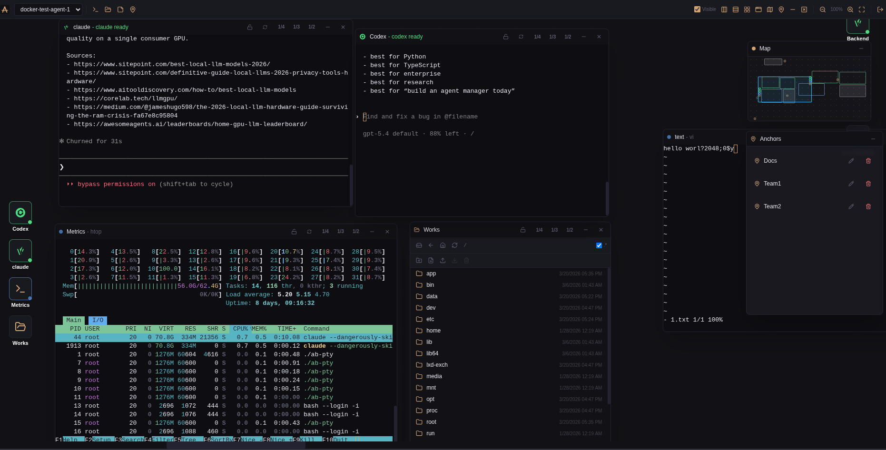
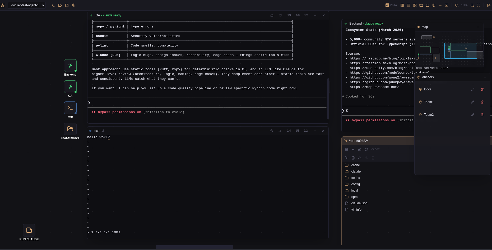

# Agent-Bridge (AB)

Welcome to Agent-Bridge.

Agent-Bridge is a persistent workspace platform for AI coding agents. It combines a PTY daemon, backend API, canvas frontend, and a deploy/orchestration root so the whole stack can be cloned and started from one place.

<p align="center">
  
  
</p>

<p align="center">
  Persistent agent workspaces, terminal sessions, canvas coordination, and deploy orchestration from a single root.
</p>

Current release series:
- `v0.1.6`

## Quick Start

For a one-command local demo stack with frontend, backend, PTY, and docker demo agents:

```bash
docker compose --env-file .env.quick-start -f docker-compose.quick-start.yml up -d
```

Or with a curl-style installer:

```bash
curl -fsSL https://raw.githubusercontent.com/agent-bridges/ab/master/install.sh | bash
```

This mode does not require copying `.env`, does not require cloning child repos, and uses the checked-in [`.env.quick-start`](./.env.quick-start) defaults plus isolated `./state/quick-start/*` paths.

Stop it with:

```bash
docker compose --env-file .env.quick-start -f docker-compose.quick-start.yml down
```

Open it:
- `http://127.0.0.1:5281`

Default login:
- username: `admin`
- password: `admin`

## Features

### `ab-front`

- agent-scoped canvas boards
- fully separate per-agent workspaces, including viewport and system panel state
- terminal, files, notes, and anchor components
- non-PTY components persisted per agent through the backend
- draggable and resizable windows
- window lock to exclude a window from global layout operations
- right-click canvas menu for creating components
- toolbar quick search for board items with jump-to-focus navigation
- PTY daemon connection settings modal for add/edit/delete/test agent connections
- per-agent saved layout snapshots stored on the backend
- minimap with viewport tracking
- anchors panel for listing anchors and centering the board on them
- layout scope switcher with `viewport`, `world`, and `rulers` modes
- draggable ruler guides for defining a viewport-local tiling region
- viewport-pinned icons with a separate viewport layer and grid
- double click on an icon centers the viewport on its window and reopens the window if it is hidden
- file manager action for creating a PTY session in the current or selected directory

### `ab-back`

- agent registry and agent management API
- per-agent non-PTY board component persistence API
- server-backed per-agent canvas layout snapshot storage
- PTY proxy and PTY session management
- file system and process proxy APIs
- SSH bootstrap disabled by default and opt-in only

### `ab-pty`

- PTY daemon for bash, GPT/Codex, and similar AI terminal sessions
- session lifecycle management
- file system access for agent workspaces
- recursive mkdir recovery endpoint
- host daemon deployment flow via published release artifact
- published daemon binaries:
  `linux/amd64 (glibc)` and `linux/arm64 (glibc)`

### Test Stack

- isolated disposable test environment
- fresh test DB and state paths
- two pre-seeded remote docker agents
- one-command bring-up and teardown
- test login: `admin / admin`

### Install Mode

Use this when you want to run Agent-Bridge from published frontend/backend images plus the locally built PTY runtime layer.

1. Clone the deploy root:

```bash
git clone https://github.com/agent-bridges/ab.git
cd ab
```

2. Create a backend JWT secret file:

```bash
mkdir -p state/back
openssl rand -hex 32 > state/back/jwt-secret
```

3. Create `.env`:

```bash
cp .env.example .env
```

Set:

```dotenv
AB_JWT_SECRET_PATH=/absolute/path/to/ab/state/back/jwt-secret
```

`AB_WORKSPACE_PATH` should point to the absolute path of the `ab` checkout. `scripts/bootstrap.sh` seeds it automatically when `.env` is first created.

4. Bootstrap and start:

```bash
scripts/bootstrap.sh
scripts/stack.sh up --mode prod
```

Default install seeds one docker-based demo agent into the main backend database and starts its daemon container automatically.

For a clean install without demo data or the extra demo daemon:

```bash
scripts/stack.sh up --mode prod --skip-test-data
```

### Dev Mode

Use this when you want bind mounts and live source changes inside containers.

For development, test/demo, and local release work, also clone the child repositories into the root:

```bash
git clone https://github.com/agent-bridges/ab-back.git ab-back
git clone https://github.com/agent-bridges/ab-front.git ab-front
git clone https://github.com/agent-bridges/ab-pty.git ab-pty
```

Then start the bind-mount development stack with:

```bash
scripts/stack.sh up --mode dev
```

Default developer mode also starts the demo agent container and seeds `docker-demo-agent` into the main backend DB.

For a clean developer stack without demo data:

```bash
scripts/stack.sh up --mode dev --skip-test-data
```

### Which Mode To Use

- `scripts/stack.sh up --mode prod`:
  image-based install mode
- `scripts/stack.sh up --mode dev`:
  bind-mount development mode
- `docker compose --env-file .env.quick-start -f docker-compose.quick-start.yml up -d`:
  one-command quick-start demo mode
- `--skip-test-data`:
  disables the default demo agent and demo seeding in prod/dev modes

## Dependencies

To run the default stack you need:
- `docker`
- `docker compose`
- `bash`
- `curl`
- `python3`
- `realpath`
- `openssl`

## Repository Layout

This repository is the deploy/orchestration root for Agent-Bridge.

It is the single entry point for:
- `ab-back`
- `ab-front`
- `ab-pty`

`ab` is not a monorepo. Child repos are required for development, test/demo, and local release work, but the default production-style startup only requires the root checkout.

Expected directory layout:

```text
ab/
  .env
  .env.example
  docker-compose.yml
  docker-compose.demo.yml
  docker-compose.dev.yml
  docker-compose.dev-demo.yml
  docker-compose.test.yml
  scripts/
  docs/
  ab-back/
  ab-front/
  ab-pty/
```

## Repositories

- [ab-back](https://github.com/agent-bridges/ab-back) - backend API and orchestration logic
- [ab-front](https://github.com/agent-bridges/ab-front) - primary canvas frontend
- [ab-pty](https://github.com/agent-bridges/ab-pty) - PTY daemon

## Default Services

Default `scripts/stack.sh up --mode prod` launches backend/front from published images and builds the local PTY runtime layer from the root repo.

The local PTY runtime layer downloads the published `ab-pty` daemon binary for:
- `linux/amd64 (glibc)`
- `linux/arm64 (glibc)`

- `ab-front`: `5281`
- `ab-back`: `8520`
- `ab-pty`: internal only
- `agent-demo`: internal only, seeded by default for install-mode validation

Open these on your deployment host or hostname, for example:
- `http://127.0.0.1:5281`
- `http://127.0.0.1:8520`

## Verification

Check containers:

```bash
scripts/stack.sh ps --mode prod
```

Check backend health:

```bash
curl http://127.0.0.1:8520/health
curl http://127.0.0.1:8520/api/auth/status
```

Useful helpers:

```bash
scripts/stack.sh logs --mode prod
scripts/stack.sh down --mode prod
```

The same scripts accept `--skip-test-data` if you want to operate only on the clean stack definition without the default demo agent:

```bash
scripts/stack.sh ps --mode prod --skip-test-data
scripts/stack.sh logs --mode prod --skip-test-data
scripts/stack.sh down --mode prod --skip-test-data
```

Development helpers:

```bash
scripts/stack.sh ps --mode dev
scripts/stack.sh logs --mode dev
scripts/stack.sh down --mode dev
```

They also support `--skip-test-data` for a clean developer stack without the demo agent.

## Test Environment

For a disposable test stack with a fresh test DB and two pre-seeded docker remote agents:

```bash
scripts/test-up.sh
```

If the test stack is already running, the script asks whether to remove and recreate it. If you answer `no`, it exits without changing the current test environment.

Before startup, the script checks:
- required local tools
- that the test ports are free on `127.0.0.1`

This starts an isolated compose project with:
- test `ab-front` on `5381`
- test `ab-back` on `8620`
- docker test agent 1 health on `19421`
- docker test agent 2 health on `19422`

Default test login:
- username: `admin`
- password: `admin`

Seeded test agents:
- `docker-test-agent-1`
- `docker-test-agent-2`

Stop it with:

```bash
scripts/test-down.sh
```

## Host Daemon Deploy

Default host-daemon flow:

```bash
scripts/daemon-deploy.ssh
```

`scripts/daemon-deploy.ssh` now downloads the published `ab-pty` release artifact for the remote host architecture and deploys it over SSH.

The wizard supports:
- SSH alias mode from `~/.ssh/config`
- host or `user@host` plus private key mode
- release tag selection
- overwrite or inspect-existing flow
- returning the daemon address and onboarding JWT for agent creation

For local development or emergency fallback, a manual artifact build is still available:

```bash
scripts/build-daemon-artifact.sh
AB_PTY_ARTIFACT_SOURCE=local scripts/daemon-deploy.ssh
```

Local fallback artifact path:

```text
ab-pty/.artifacts/ab-pty-linux-amd64-glibc
```

## Documentation

- [`AGENTS.md`](./AGENTS.md) - operator notes for agentic coding tools
- [`docs/TOPOLOGY.md`](./docs/TOPOLOGY.md) - repository and runtime topology
- [`docs/DEPLOY.md`](./docs/DEPLOY.md) - deployment and runtime policy
- [`BACKLOG.md`](./BACKLOG.md) - open technical debt and deferred design work
